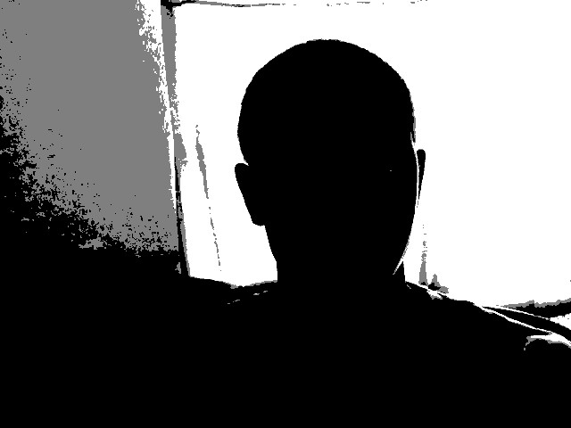
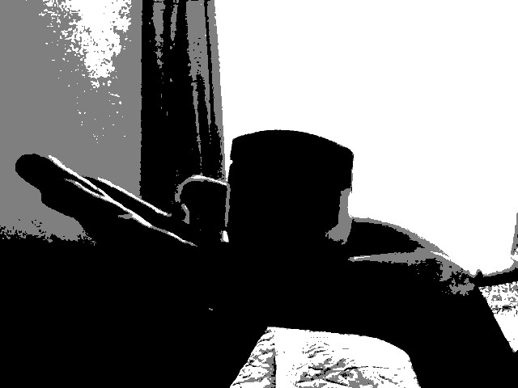
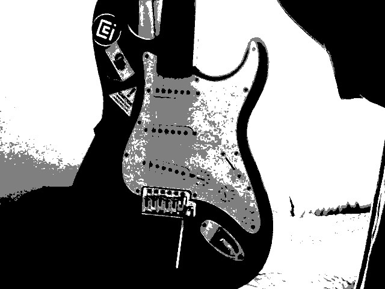
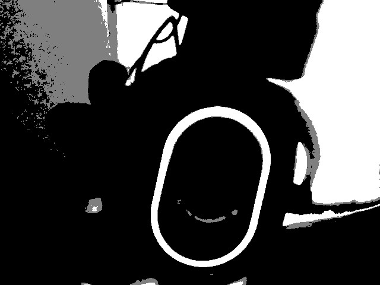
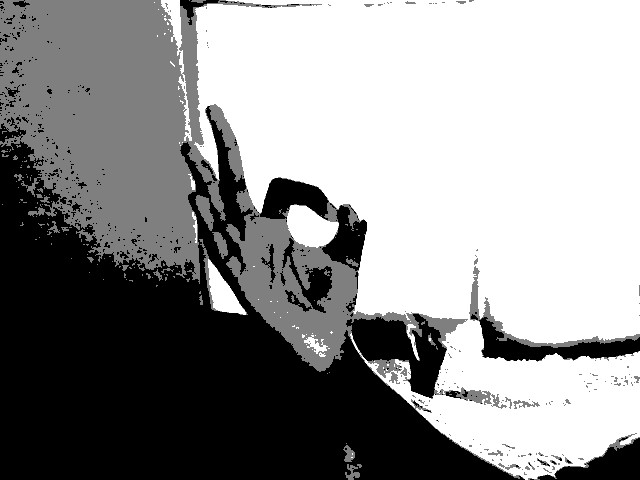
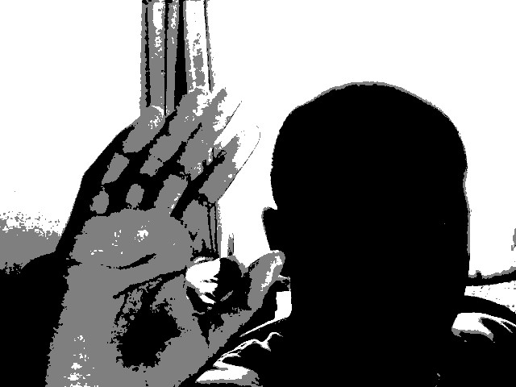
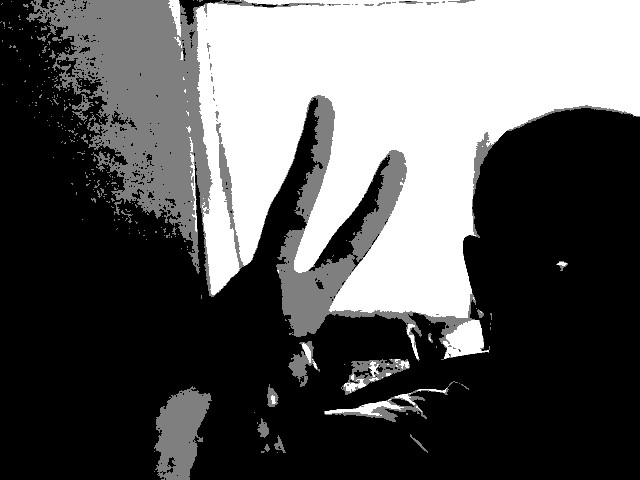
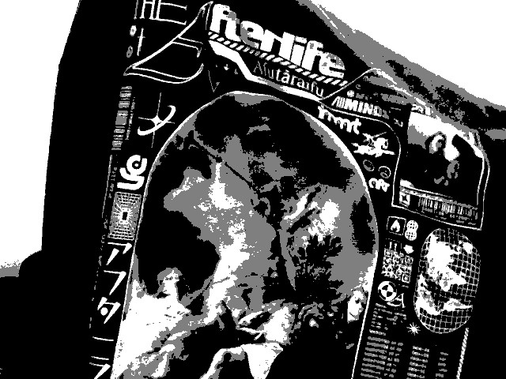
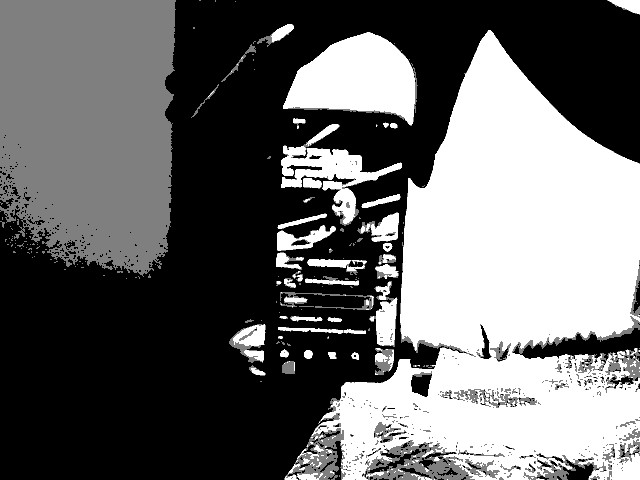
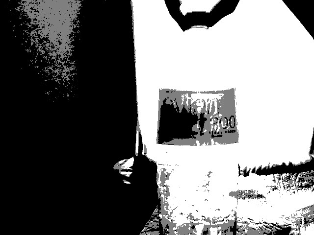

# Week 06: Dithering and Convolution

## Directory contents

> Cam_Work:

In class we were provided code for us to improve over time by implementing techniques explored from class.

This sketch features:

. Live webcam feed

. Dithering / Error diffusion

. Pixel Processing

. Bright Pixels become white (255)

. Dark Pixels become black(0)

. Saved frames using saveFrame()

- Done by processing webcam input in real time by changing pixel values into limited tones.
- Experimenting with dithering strengths and threshold values to see how image quality and texture quality had changed. Multiple screenshots were saved from different versions of the sketch to compare results.

The Results:

